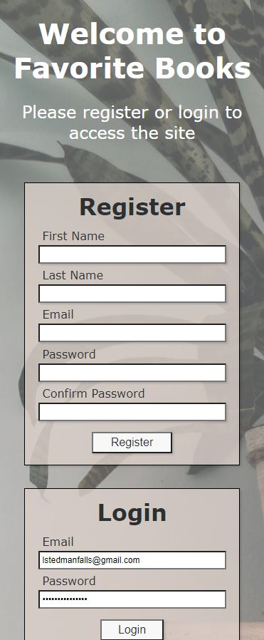
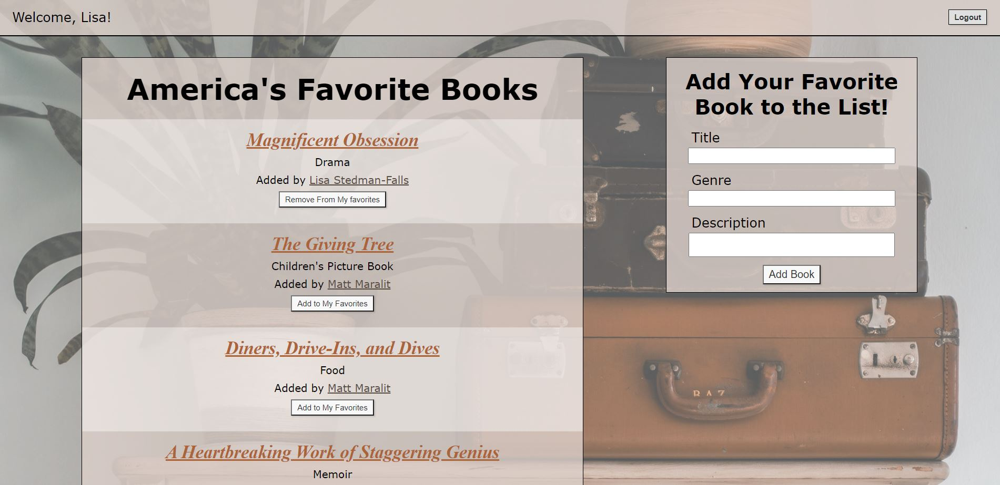
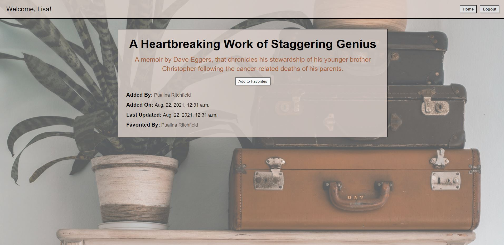

<h1>Favorite Books App</h1>
<h2>Fully-responsive web app with user login and registration (inlcuding password hashing and salting), form validations, user-added content, ability to favorite content</h2>

 Python, Django, bcrypt, SQLite

<h2>Login page PC</h2>

<h2>Login page Mobile</h2>

<h2>Book Wall PC</h2>

<h2>Book Profile PC</h2>
