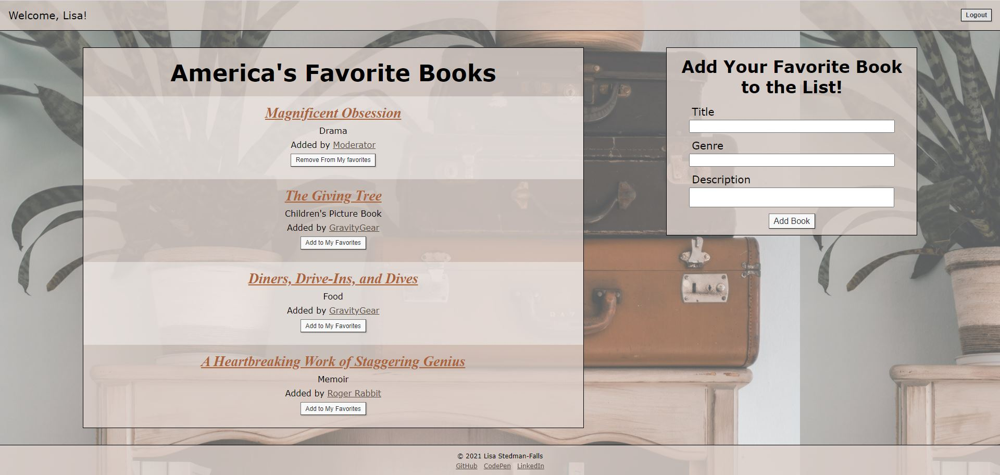
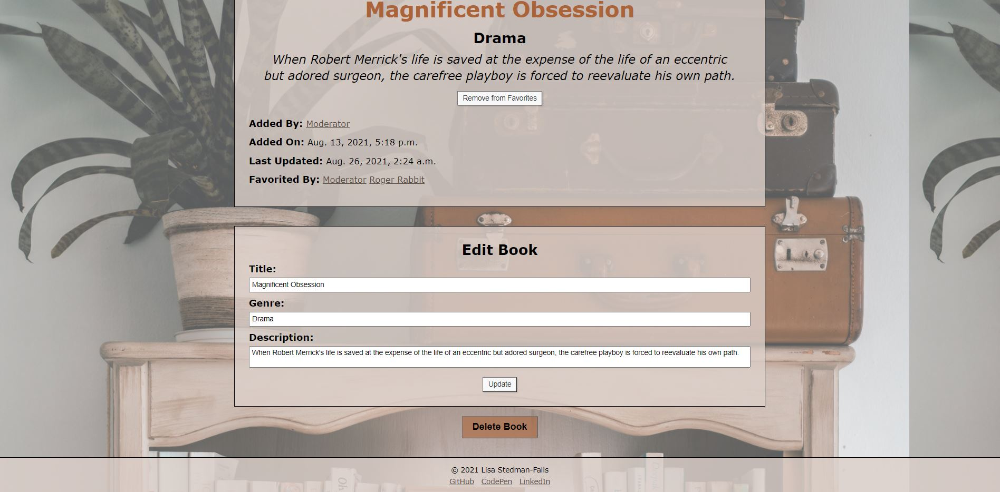
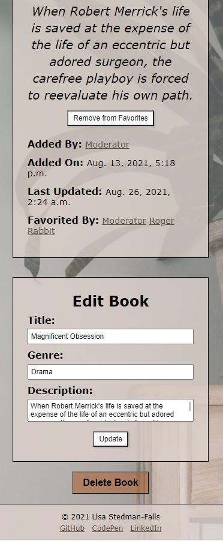

<h1>Favorite Books App</h1>
<h2>Responsive social media web app for adding, favoriting, and reviewing books</h2>

 Admin / user login and registration with password hashing and salting, user-specific views, user-added content / favoriting / reviewing / editing, form validations, and user and book profiles

 Created with Python, Django MVC / ORM / templating, SQLite, bcrypt, CSS, and HTML

<h3>Login PC</h3>

<h3>Login Mobile</h3>

<h3>Book Wall PC</h3>

<h3>Book Wall Mobile</h3>

<h3>Public Book Profile PC</h3>

<h3>Public Book Profile Mobile</h3>

<h3>Own Book Profile PC</h3>

<h3>Own Book Profile Mobile</h3>
